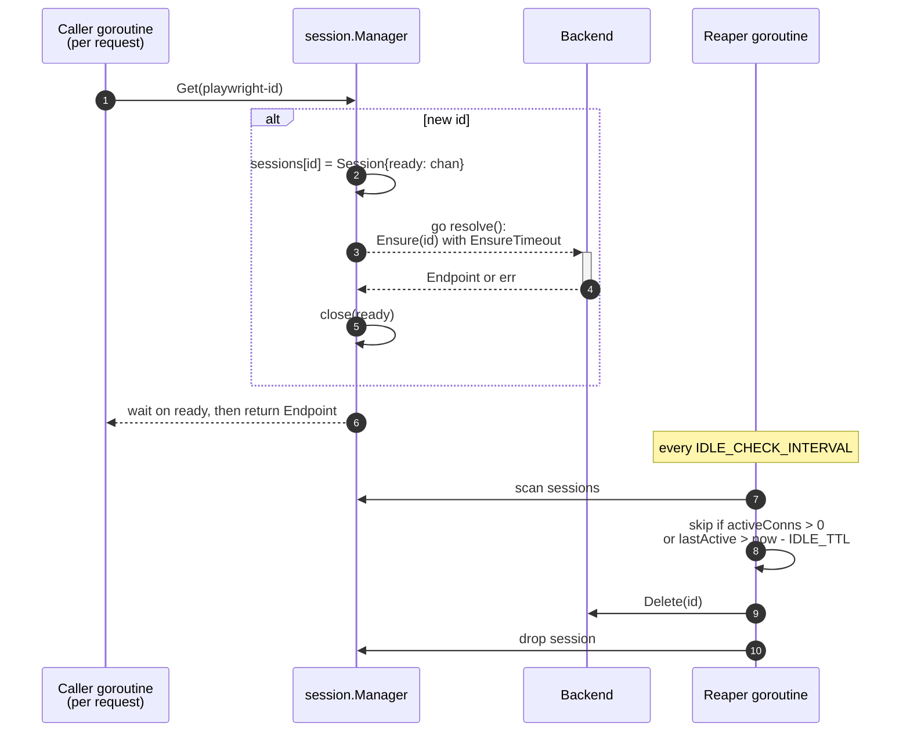
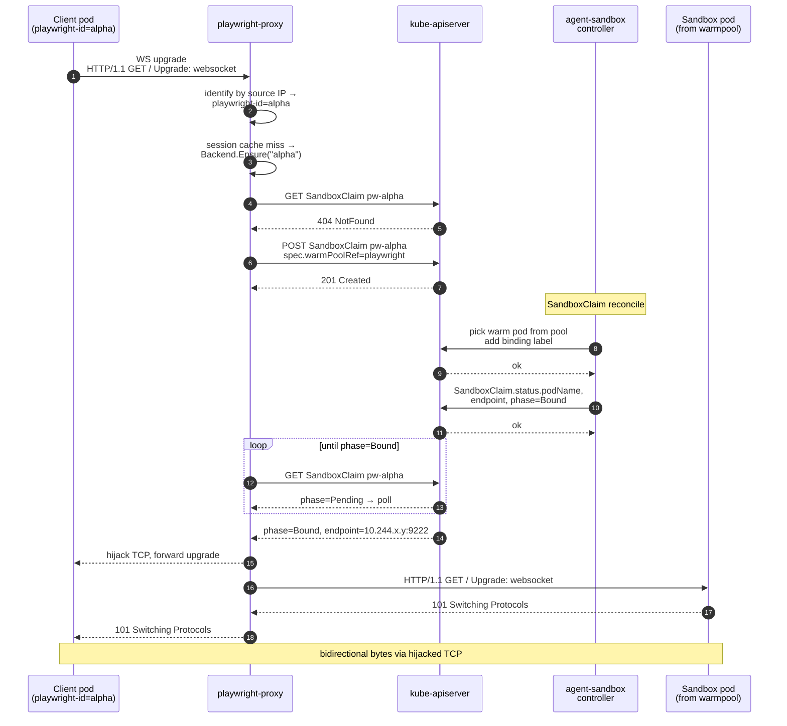
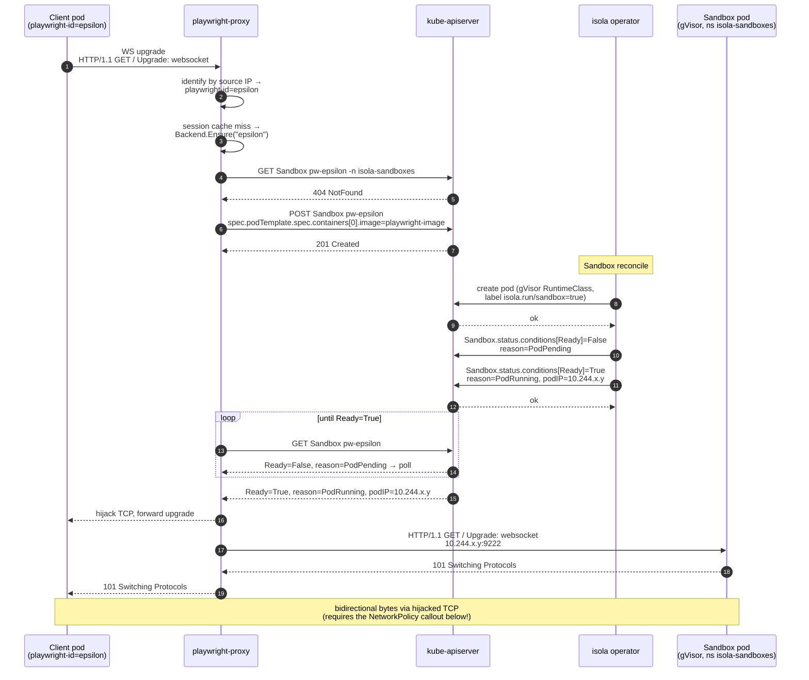
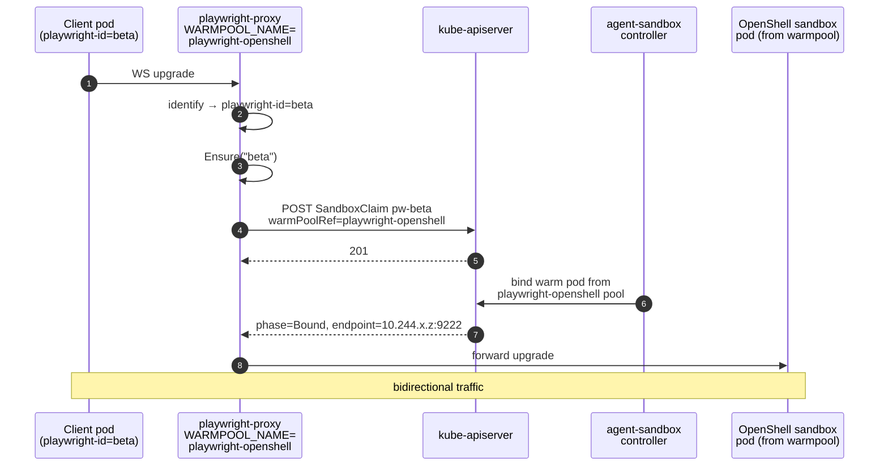
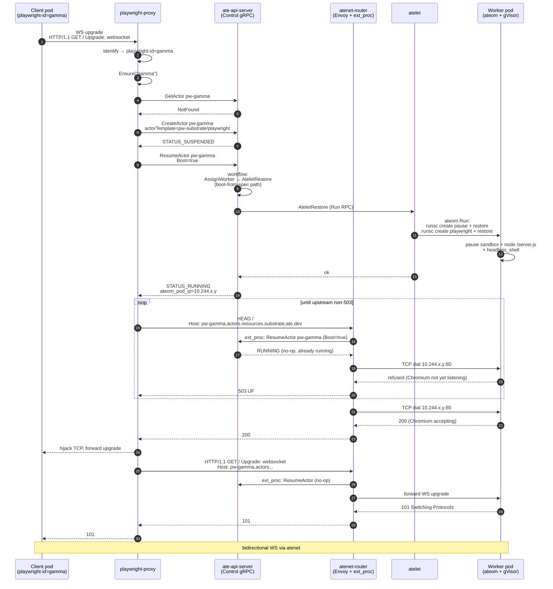
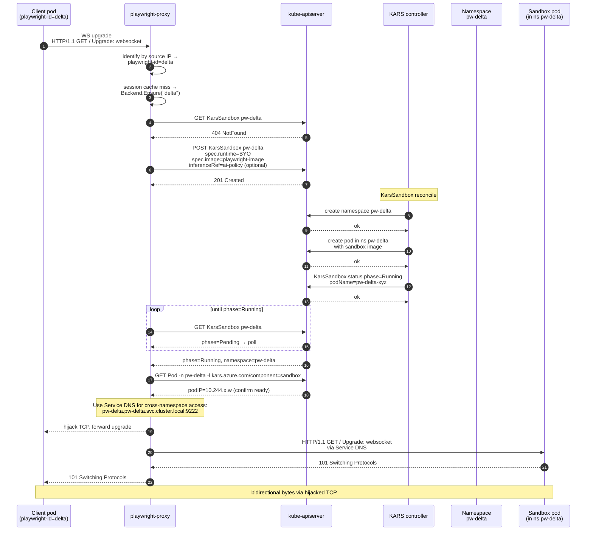

# Architecture

A per-namespace HTTP/WebSocket proxy that fronts Playwright (MCP over HTTP +
the native Playwright WebSocket server) and routes each calling agent pod to a
dedicated Playwright sandbox. Five backends are pluggable behind a single
interface; agent-sandbox and OpenShell share the same SandboxClaim machinery,
substrate uses ate.dev's Actor lifecycle and atenet-router as the data plane,
KarsSandbox uses Azure's KARS controller for isolated namespace-scoped sandboxes,
and isola runs each sandbox as a gVisor-isolated `Sandbox` CR in a single shared
namespace.

- [Components](#components)
- [Identity model](#identity-model)
- [Session manager and idle reaper](#session-manager-and-idle-reaper)
- [Backends](#backends)
  - [agent-sandbox](#agent-sandbox)
  - [isola](#isola)
  - [OpenShell](#openshell)
  - [substrate](#substrate)
  - [KarsSandbox](#karssandbox)
- [Bench harness and results](#bench-harness-and-results)

## Components

```
┌─ agent pod ─┐                ┌─ playwright-proxy ─┐                ┌─ backend ──────────┐
│  labels:    │                │ identify (informer)│                │                    │
│   playwright├──HTTP / WS────▶│ session.Manager    ├──Ensure(id)───▶│ SandboxClaim       │
│   -id: ...  │                │  (singleflight)    │                │   or Actor (gRPC)  │
└─────────────┘                │ reverse proxy      │                └─────────┬──────────┘
                               │ idle reaper        │                          │
                               │ /healthz /readyz   │                ┌─────────▼──────────┐
                               └────────┬───────────┘                │ Playwright sandbox │
                                        │                            │ pod or actor       │
                                        └──HTTP / WS upgrade────────▶│ chromium WS server │
                                                                     └────────────────────┘
```

| Layer                       | Source                                | Responsibility |
|-----------------------------|---------------------------------------|----------------|
| `internal/identify`   | client-go shared informer on labelled pods + API list fallback | `podIP → playwright-id` lookup with cache-miss fallback to a `fieldSelector=status.podIP=X` API list. Bounded polling (100ms × 100) covers the pod-IP-not-yet-populated race. |
| `internal/session`    | Map keyed by playwright-id            | `Ensure` is singleflight per id; `Get` returns the cached endpoint or waits on the in-flight Ensure. Reaper sweeps idle sessions when both `lastActive` and `activeConns` say it's safe. |
| `internal/backend`    | `Backend` interface (Ensure/Delete/List) | Five implementations: `SandboxClaim` (agent-sandbox + openshell), `Substrate` (ate.dev), `KarsSandbox` (Azure KARS), `IsolaBackend` (isola/gVisor). |
| `cmd/playwright-proxy`| `main.go`                             | Wires it together. `/readyz` blocks until `identify.Index.Ready()` (i.e. the informer cache has synced) so kube probes don't admit traffic before pod identity is resolvable. |

## Identity model

Each agent pod sets a stable **label** in its pod spec:

```yaml
metadata:
  labels:
    playwright-id: my-app-prod    # any stable id; one sandbox per id
```

On every incoming request:

1. Source IP is read from `r.RemoteAddr`. In-cluster pod→ClusterIP traffic
   preserves the client pod IP on every modern CNI.
2. The identify index translates IP → `playwright-id`. Cache miss?
   - Fall back to a one-shot `kubectl get pods -A --field-selector=status.podIP=<ip>` via the API.
   - Then bounded polling for up to 10s in case the informer hasn't seen the
     pod yet (a labelled pod that started in the last few ms).
3. Pod is unlabelled → 403. Identifier can't be resolved within budget → 403.
4. With an id in hand, the session manager either returns a cached endpoint or
   does `Backend.Ensure` (singleflight).
5. HTTP body and WebSocket upgrades are reverse-proxied to the backend endpoint.

Identity is **label-driven**, not annotation-driven, so the workload owner sets
it once in their Deployment and a pod reschedule keeps the same identifier.

## Session manager and idle reaper



Soft-policy reaper: a session is reaped only when **both** `lastActive < now -
IDLE_TTL` **and** `activeConnections == 0`. A long-lived but silent WebSocket
keeps the sandbox alive.

## Backends

All five implement the same interface:

```go
type Backend interface {
    Ensure(ctx context.Context, id string) (Endpoint, error)
    Delete(ctx context.Context, id string) error
    List(ctx context.Context)              ([]string, error)
}
```

Quick comparison:

| Backend       | Sandbox unit       | State across reaps? | Cold-start cost |
|---------------|--------------------|---------------------|-----------------|
| agent-sandbox | `SandboxClaim` → warm pod | **No** — claim deleted ⇒ pod destroyed; next call gets a fresh pod | ~0.6s (warmpool is pre-warmed; main cost is the WS handshake) |
| isola         | `Sandbox` CR → gVisor-isolated pod in a shared namespace | **No** — CR deleted (default `TerminationPolicy=Delete`) ⇒ pod destroyed; next call gets a fresh sandbox. (A `SnapshotRootfs` termination type exists in isola but is unused by this backend.) | Variable (gVisor pod cold-start + image pull; no warm pool) |
| openshell     | `SandboxClaim` → warm pod (openshell image) | **No** — same as agent-sandbox | ~0.6s |
| substrate     | `Actor` → gVisor sandbox on a worker pod | **Designed to**, via gVisor checkpoint/restore; **disabled here** (`SUBSTRATE_FORCE_BOOT=true`) because restore is broken in this environment | ~3.6s with boot-from-spec; would be sub-second with working snapshot restore |
| karssandbox   | `KarsSandbox` CR → namespaced pod | **No** — CR deleted ⇒ namespace + pod destroyed; next call gets a fresh isolated sandbox | Variable (depends on KARS controller + image pull; typically similar to agent-sandbox) |

Across all five, "sticky while alive" still holds: as long as the proxy's
session is not reaped (idle timer + no live connections), repeat calls from
the same id always hit the same sandbox. The difference is whether state
*survives* a reap/restart.

### agent-sandbox

One `SandboxClaim` per `playwright-id`, claiming from a `SandboxWarmPool`.
The agent-sandbox controller binds the claim to a warm pod from the pool.

**State across runs:** none. A SandboxClaim binds a pod from the warmpool; when
the claim is deleted (idle reap, or `Delete(id)`) the pod is destroyed and the
warmpool is replenished with a fresh one. There is no checkpoint/restore — the
next caller for the same id gets a brand-new sandbox with no memory of the
previous session (no cookies, no in-memory page state, no open Chromium
contexts). Reuse only happens *while the sandbox is alive*: same id within
IDLE_TTL with no claim deletion in between sticks to the same pod.



Idempotency: a second caller for the same id finds the existing claim and
short-circuits to the bound endpoint. `Delete` deletes the claim; the
controller releases the pod back to the pool.

### isola

One `Sandbox` custom resource (`sandbox.isola.run/v1alpha1`) per `playwright-id`,
using [isola](https://github.com/isola-run/isola)'s Kubernetes operator and
gVisor for per-pod syscall-level isolation. **Unlike agent-sandbox, there is no
warm pool**: every `Ensure` for a new id creates a brand-new Sandbox CR and
waits for the operator to schedule and start a pod from scratch, rather than
binding an already-running pod from a pre-warmed `SandboxWarmPool`. All Sandbox
CRs (and their pods) still live in one shared, pre-existing namespace
(`ISOLA_NAMESPACE`, e.g. `isola-sandboxes`) — topologically similar to
agent-sandbox's warm-pool namespace, just without the pool. The proxy polls the
CR's `status.conditions[type=Ready]` until `status=True`, then reads
`status.podIP` directly off the CR — structurally the same single-CR-poll
pattern as agent-sandbox's `SandboxClaim.status.podName`/`endpoint`, just
without a pool to bind from.

**State across runs:** none. A Sandbox CR's default `TerminationPolicy.Type`
is `Delete`: when the CR is deleted (idle reap, or `Delete(id)`) the pod is
torn down and the next caller for the same id gets a brand-new sandbox — same
"no memory of the previous session" behavior as agent-sandbox. (isola also
supports a `SnapshotRootfs` termination type that snapshots the rootfs overlay
to S3/GCS/Azure for later restore into a new sandbox via
`rootfsSnapshotSources` — the closest isola analogue to substrate's gVisor
checkpoint/restore, but simpler and more mature: it's an async job backed by
cloud storage rather than a live sentry checkpoint. This backend does not use
it today; wiring it in is a natural follow-up for state persistence across
reaps.)

**Key differences from agent-sandbox:**
- **No warm pool**: agent-sandbox binds an already-running pod from a
  `SandboxWarmPool` in ~0.6s; isola creates a pod from scratch on every
  `Ensure`, so cold start is bounded by image pull + gVisor pod scheduling
  rather than a claim-and-bind operation.
- **gVisor isolation, not just the node's default runtime**: agent-sandbox
  pods run under whichever container runtime the cluster uses by default
  (typically runc — standard Linux namespace/cgroup isolation); isola pods run
  under a gVisor `RuntimeClass`, adding a syscall-interception security
  boundary — relevant for untrusted or AI-generated code — at the cost of
  gVisor's overhead.
- **Sandbox spec embedded in the CR, not a separate template**: agent-sandbox
  pods are defined ahead of time via a separate `SandboxTemplate` +
  `SandboxWarmPool` that the claim references; isola's Sandbox CR embeds the
  pod spec directly (`spec.podTemplate`), so there's no separate
  template/pool object to provision.
- **NetworkPolicy required for proxy ingress**: agent-sandbox pods have no
  special NetworkPolicy restricting proxy access — the proxy just reaches the
  bound pod's IP directly. isola's Helm chart installs a default-deny
  NetworkPolicy on every sandbox pod that blocks all ingress except from
  isola's own api-gateway, so a companion NetworkPolicy must be applied for
  the proxy to reach the Playwright port at all (see the callout below).



> **NetworkPolicy gotcha — read this before deploying isola.**
> isola's Helm chart installs a `sandbox-default-deny` `NetworkPolicy` that
> denies **all** ingress and egress to every pod labeled `isola.run/sandbox: "true"`
> in the sandbox namespace, plus a `sandbox-allow-api-gateway-ingress` policy
> that opens ingress **only** from isola's own `api-gateway` pod, and **only**
> on port `10032` (the sandbox sidecar's control port for command/file exec —
> not the Playwright/Chromium port). playwright-proxy is not isola's
> api-gateway, so **out of the box the proxy cannot reach a sandbox pod's
> Playwright port at all** — every WS upgrade will hang/timeout after
> `Ensure` succeeds. You must apply
> `deploy/examples/isola/networkpolicy-allow-proxy.yaml` once (cluster-side,
> in the sandbox namespace) to open ingress from the playwright-proxy pod to
> `isola.run/sandbox=true` pods on `SANDBOX_PORT`. This is a single static,
> label-selector-based policy — it is **not** created per-sandbox by the
> backend code, since one rule already covers every Sandbox CR the proxy
> creates.

**Egress:** the operator's own default is deny-all egress *and* a DNS sink,
which would leave a sandbox unable to resolve or reach anything an agent
navigates to. `IsolaBackend` therefore sets `spec.network.allowInternetEgress`
and `allowClusterDNS` to `true` on every Sandbox it creates — a sensible
default for a backend whose whole purpose is browsing arbitrary pages. Note
that `allowInternetEgress` does **not** open private/cluster-internal ranges
(isola excepts them even with internet egress on), so reaching an in-cluster
target (e.g. a test fixture Service) additionally requires its CIDR in
`ISOLA_ALLOWED_EGRESS_CIDRS` (optional, comma-separated; see Configuration below).

**Configuration:**
```bash
BACKEND=isola
ISOLA_NAMESPACE=isola-sandboxes                # Default; must match isola's
                                                # Helm value sandboxNamespace.name
ISOLA_SANDBOX_IMAGE=<your-playwright-image>    # Required: sandbox container image
ISOLA_ALLOWED_EGRESS_CIDRS=10.0.0.0/8          # Optional: extra egress CIDRs
                                                # beyond the default internet-egress
                                                # allowance (see Egress note above)
SANDBOX_PORT=9222                              # Default: application listen port
```

**RBAC requirements:**
```yaml
apiVersion: rbac.authorization.k8s.io/v1
kind: ClusterRole
metadata:
  name: playwright-proxy-isola
rules:
- apiGroups: ["sandbox.isola.run"]
  resources: ["sandboxes"]
  verbs: ["get", "list", "watch", "create", "delete"]
- apiGroups: ["sandbox.isola.run"]
  resources: ["sandboxes/status"]
  verbs: ["get"]
```
Note: no `pods` RBAC is needed — `status.podIP` comes straight off the Sandbox CR.

See `deploy/examples/isola/` for complete deployment manifests, including the
mandatory NetworkPolicy described above.

**Testing:**
```bash
# Install isola (operator + CRDs) into the existing cluster. Requires a gVisor
# RuntimeClass on cluster nodes for real isolation — see the up-isola comments
# in test/harness.sh for the known gVisor-in-kind limitation.
./test/harness.sh up-isola

# Run integration tests
./test/harness.sh test isola

# Run benchmarks (cold/warm/restore)
./test/bench.sh isola

# Cleanup
./test/harness.sh down-isola
```

### OpenShell

Mechanically identical to agent-sandbox — same `SandboxClaim` CRD, same
controller. The difference is the `SandboxTemplate` and `SandboxWarmPool` that
the claim points at (OpenShell flavour ships a different image). The proxy
only sees `WARMPOOL_NAME=playwright-openshell` instead of `playwright`.

**State across runs:** none, same as agent-sandbox. Claim destroyed → pod
destroyed → next call gets a fresh sandbox.



Run both backends in the same cluster by deploying two proxies pointed at
different warm pools.

### substrate

Substrate owns the data plane — `atenet-router` (Envoy + ext_proc) dispatches
to an actor pod by `Host: <actor-id>.actors.resources.substrate.ate.dev`. The
proxy's job is to: (a) identify the caller, (b) ensure an Actor exists and is
RUNNING via the ate-api Control gRPC, (c) probe atenet for upstream readiness,
(d) hand the WS upgrade off to atenet with the rewritten Host header.

**State across runs:** in principle yes, via substrate's gVisor checkpoint /
restore — a SuspendActor saves the actor's full sandbox state to S3
(`rustfs` here) and a subsequent ResumeActor restores it. The actor lives
across pod reschedule and across the agent's idle reaper. **In practice
disabled here:** in this environment the restore leaves the playwright
sub-container in `status: stopped, pid: -1`, so we force boot-from-spec via
`SUBSTRATE_FORCE_BOOT=true` (see [Why `Boot=true`](#why-boottrue) below).
That effectively makes substrate behave like agent-sandbox/openshell from a
state-persistence standpoint until the upstream restore bug is fixed.



#### Why `Boot=true`

Substrate's snapshot restore (both golden and per-actor) leaves the playwright
sub-container in `status: stopped, pid: -1` in the gVisor sandbox in this
environment — `runsc list` confirms the pause container runs but the
`node /server.js` process never reattaches. Boot-from-spec is reliable and we
turn it on with `SUBSTRATE_FORCE_BOOT=true`. The substrate-side companion fix
(local commits `c4338f8 fix(atenet): enable WebSocket upgrades in HCM` +
`caa2158 fix(resume): honor Boot=true for per-actor snapshot, propagate via
atenet`) makes Boot=true bypass the per-actor snapshot path and propagates it
through atenet's own per-request resumer so the workaround is consistent
end-to-end.

#### Why the upstream readiness probe

`runsc restore … -direct -background -detach` returns exit 0 as soon as the
sentry has accepted the restore request. With those flags the sandbox lazily
pages in memory and the in-sandbox Node process is not yet bound to port 80
when `STATUS_RUNNING` is reported. atenet would forward the WS upgrade
immediately, get a `connect 111 refused`, and return 503 to the client. The
proxy's `waitUpstreamReady` runs HEAD probes against atenet (re-using the same
Host header it will use for the real upgrade) until atenet stops returning
503, so the client only sees latency.

### KarsSandbox

One `KarsSandbox` custom resource (CR) per `playwright-id`, using Azure's KARS
(Kubernetes Azure Runtime Sandboxes) controller. The KARS controller provisions
an isolated namespace per sandbox and creates the sandbox pod within it. The
proxy polls `status.phase=Running`, then locates the pod IP via the CoreV1 API.

**State across runs:** none. A KarsSandbox CR creates a dedicated namespace
and pod; when the CR is deleted (idle reap, or `Delete(id)`) both the namespace
and pod are destroyed by the KARS controller. The next caller for the same id
gets a brand-new isolated sandbox. Like agent-sandbox and openshell, reuse only
happens *while the sandbox is alive*.

**Key differences from agent-sandbox:**
- **Namespace isolation**: Each sandbox gets its own namespace, not just a pod
- **No warm pool**: KARS creates pods on-demand rather than binding from a pre-warmed pool
- **Azure integration**: Designed for Azure Kubernetes Service (AKS) with optional
  InferencePolicy support for AI/GPU workloads
- **BYO runtime**: Uses "Bring Your Own" runtime mode, allowing custom sandbox images



**Network isolation:**
KARS sandboxes run in isolated namespaces with NetworkPolicies that block
cross-namespace pod-to-pod traffic. The proxy uses Service DNS names
(`<sandbox-name>.<sandbox-namespace>.svc.cluster.local`) instead of pod IPs
to route traffic. Currently, KARS Services only expose port 8443 (inference-router);
additional configuration may be needed to expose custom application ports.

**Configuration:**
```bash
BACKEND=karssandbox
KARS_SANDBOX_IMAGE=<your-playwright-image>     # Required: sandbox container image
KARS_INFERENCE_REF=<inference-policy-name>     # Optional: for AI/GPU workloads
SANDBOX_PORT=9222                              # Default: application listen port
```

**RBAC requirements:**
The proxy needs additional permissions to interact with KarsSandbox CRs:
```yaml
apiVersion: rbac.authorization.k8s.io/v1
kind: ClusterRole
metadata:
  name: playwright-proxy-kars
rules:
- apiGroups: ["kars.azure.com"]
  resources: ["karssandboxes"]
  verbs: ["get", "list", "watch", "create", "delete"]
- apiGroups: ["kars.azure.com"]
  resources: ["karssandboxes/status"]
  verbs: ["get"]
- apiGroups: [""]
  resources: ["pods"]
  verbs: ["get", "list"]  # To locate pod IP after KarsSandbox is Running
```

See `deploy/examples/kars/` for complete deployment manifests including
proxy configuration, RBAC patches, and InferencePolicy examples.

**Testing:**
```bash
# Create KARS cluster with controller
./test/harness.sh up-kars

# Run integration tests
./test/harness.sh test kars

# Run benchmarks (cold/warm/restore)
./test/bench.sh kars

# Cleanup
./test/harness.sh down-kars
```

## Bench harness and results

`proxy/test/bench.sh` exercises three scenarios per backend (note: KARS and
isola backend benchmarks are available but results not yet included in the
table below):

| Scenario   | What it measures |
|------------|------------------|
| `cold`     | First request after the prior session is wiped: full Ensure (CreateActor + ResumeActor + readiness probe for substrate; CreateClaim + bind for sandboxclaim). |
| `warm`     | Second request reusing the cached session: just the proxy hop + WS upgrade. |
| `restore`  | Out-of-band suspend then a fresh request. For sandboxclaim this re-creates the claim (== cold). For substrate it forces boot-from-spec with the proxy's session cache invalidated by a rollout restart. |

The bench's Playwright client (`proxy/test/playwright-scripts.yaml`) emits a
single `BENCH {…}` JSON line with per-phase timings:

- `connect_ms` — `chromium.connect(wsEndpoint)` round-trip (includes
  Ensure + WS upgrade + handshake).
- `newPage_ms` — `browser.newContext().newPage()` after connect.
- `goto_ms`    — `page.goto(targetURL)` to an in-cluster `whoami` upstream.
- `total_ms`   — wall-clock total of the three above.

### Results

Run on Colima 16 GiB / 6 CPU, kind 1.33, arm64. All nine scenarios pass.

| backend       | scenario | result | connect_ms | newPage_ms | goto_ms | total_ms |
|---------------|----------|--------|-----------:|-----------:|--------:|---------:|
| agent-sandbox | cold     | PASS   |        579 |        192 |      34 |      805 |
| agent-sandbox | warm     | PASS   |         23 |         23 |      13 |       59 |
| agent-sandbox | restore  | PASS   |        544 |         37 |      14 |      595 |
| openshell     | cold     | PASS   |        556 |         42 |      19 |      617 |
| openshell     | warm     | PASS   |         23 |         32 |      13 |       68 |
| openshell     | restore  | PASS   |        549 |         47 |      16 |      612 |
| substrate     | cold     | PASS   |       3610 |         72 |      33 |     3715 |
| substrate     | warm     | PASS   |         29 |         48 |      27 |      104 |
| substrate     | restore  | PASS   |        133 |         50 |      15 |      198 |

Reading the numbers:

- **Warm is dominated by the WS handshake** for all three backends (~20–30ms
  connect, ~30–50ms newPage, ~15–30ms goto). The proxy-hop itself adds
  single-digit ms.
- **agent-sandbox / openshell cold ≈ 550–600ms**: the SandboxClaim controller
  binds the warm pod almost immediately, so most of the time is the WS
  handshake to a Playwright server that was already serving.
- **substrate cold is ~6× higher** (3.6s) because boot-from-spec actually
  starts Node + Chromium from scratch in a fresh gVisor sandbox. There is no
  warm pool of pre-booted actors — substrate's pool is pre-booted *worker
  pods* (ateom + gVisor) that still need to launch the user workload.
- **substrate restore is fast** (198ms) because the bench suspends and
  immediately re-resumes on the *same* worker pod; the OCI bundle is still
  laid out and Node spins up quickly.
- **agent-sandbox / openshell restore ≈ cold** because for SandboxClaim there
  is no snapshot — the bench wipes the claim and lets the controller bind a
  fresh warm pod.

### Reproducing

```sh
# Bring up all kind clusters (one-time per machine)
./test/harness.sh up                            # 'playwright-proxy' cluster for sandboxclaim
( cd substrate && hack/create-kind-cluster.sh \
    && hack/install-ate-kind.sh --deploy-ate-system ) # 'kind' cluster for substrate
./test/harness.sh up-kars                       # KARS cluster with controller
./test/harness.sh up-isola                      # isola cluster with operator (gVisor RuntimeClass)

# Run the full bench
./test/bench.sh all                             # agent-sandbox + openshell + substrate + kars + isola
./test/bench.sh substrate                       # substrate only
./test/bench.sh kars                            # KARS only
./test/bench.sh isola                           # isola only
```

`bench.sh` does a `kubectl-ate admin debug-flush-redis` and a worker recycle
between full runs to keep results comparable; if you skip those, expect
slightly faster cold numbers on substrate because the prior actor's OCI
bundle is still warm in `/run/ateom-gvisor`.

## Caveats

- Source-IP identity assumes in-cluster pod→ClusterIP traffic. Going through
  an Ingress, LB, or `externalTrafficPolicy: Cluster` Service loses the source
  IP — the proxy will return 403 because it can't identify the caller.
- `hostNetwork` clients share the node IP and cannot be identified; reject
  them at the pod-admission layer or layer in SPIFFE / token validation.
- Label values must satisfy Kubernetes label constraints (≤63 chars,
  `[a-zA-Z0-9._-]`). For longer/free-form ids, hash into the label and stash
  the original in an annotation. isola's Sandbox CRD has an even tighter
  constraint — `metadata.name` is capped at 47 chars — so `internal/backend/isola.go`'s
  `isolaName` hashes into the CR name itself when `"pw-" + id` would exceed it
  (see the [isola](#isola) section).
- The substrate workaround keeps `SUBSTRATE_FORCE_BOOT=true` on by default in
  `proxy/test/proxy-substrate.yaml`. Once substrate's snapshot restore is
  fixed upstream, flip it back to `false` to get sub-second cold-starts via
  golden snapshot.
