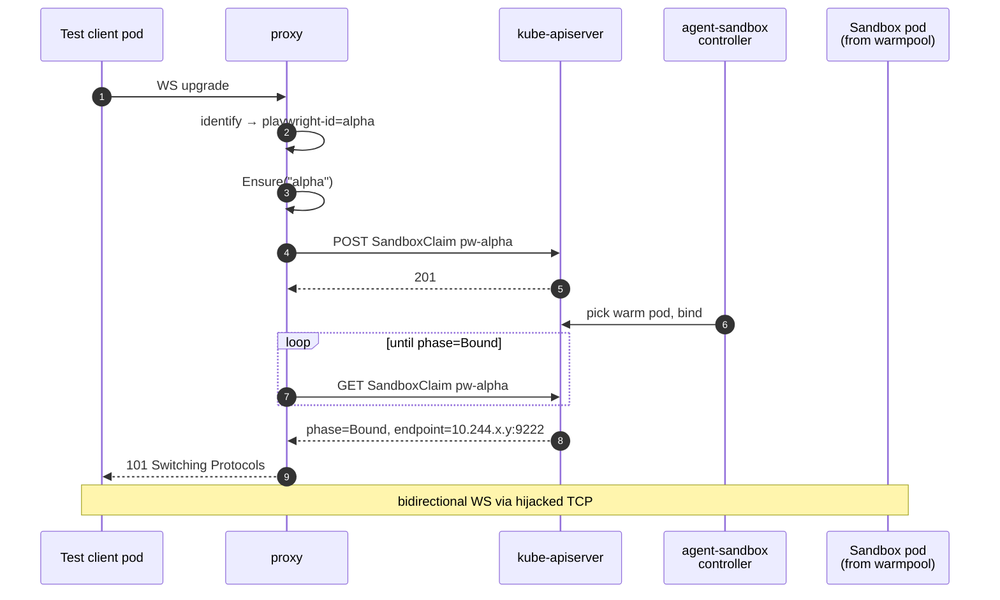
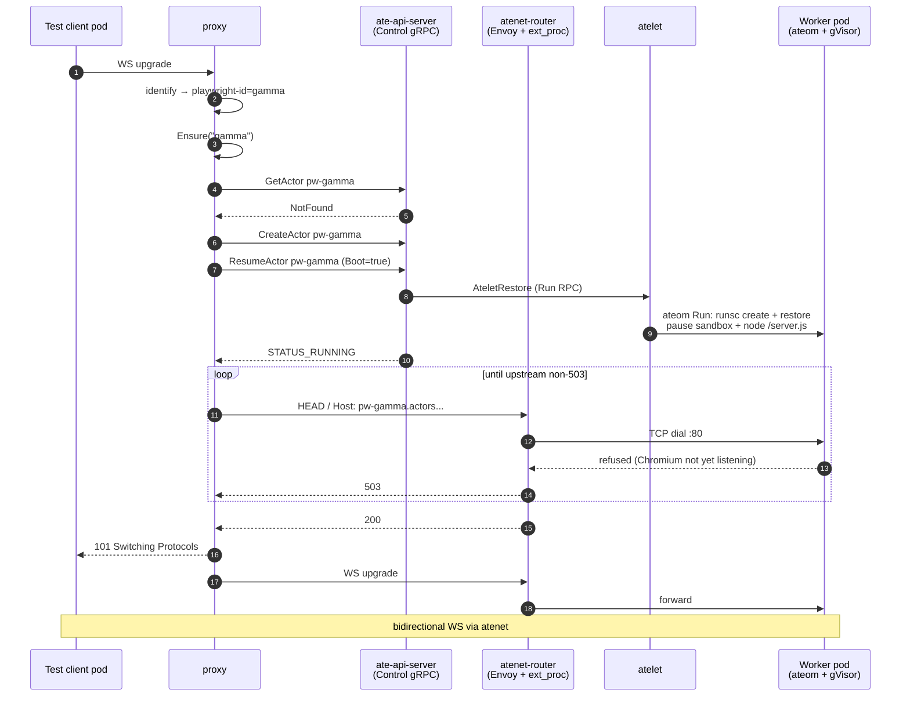
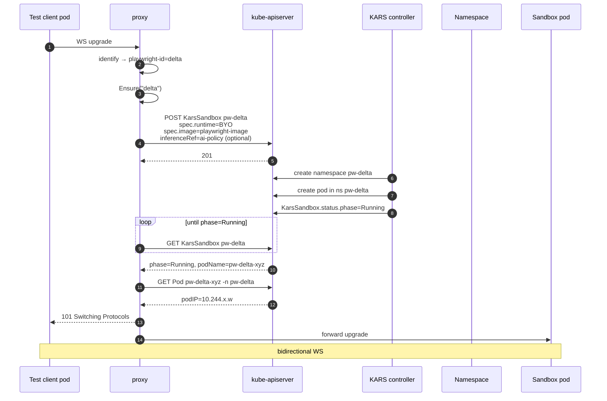

# Testing Kubernetes sandboxing technologies, using Playwright as the workload

There are several flavours of "give a workload its own isolated runtime
on Kubernetes" floating around right now. We wanted a head-to-head
comparison — not a slide-deck comparison, but one with real numbers
against a non-trivial workload that exercises identity routing, port
forwarding, WebSocket upgrades, and a heavy long-lived process. Playwright
driving Chromium is exactly that workload. This post walks through how
we tested four sandboxing technologies — `agent-sandbox`, `OpenShell`,
`substrate`, and `KarsSandbox` — against the same Playwright harness, what we found,
and what each option is actually good at.

The harness and bench live at
[github.com/carlossg/playwright-k8s-sandbox](https://github.com/carlossg/playwright-k8s-sandbox).
The deep-dive architecture doc with full sequence diagrams is at
[`docs/ARCHITECTURE.md`](../ARCHITECTURE.md).

## Why Playwright as the test workload

Most sandboxing demos use `traefik/whoami` or `nginx`. Both are useful
for a smoke test and useless for telling sandboxing options apart,
because they don't stress anything. Real agent workloads do. Playwright
gives us, in one process tree:

- A **long-lived stateful process** (Chromium with ~6 child processes,
  hundreds of MB of memory).
- A **native WebSocket protocol** (`chromium.connect(wsEndpoint)`),
  which requires HTTP upgrade handling end-to-end through the data
  plane.
- A **non-trivial cold-start cost** that's measurable and stable
  (Node + Chromium boot is ~3 seconds).
- A **real possibility of checkpoint/restore value** — Chromium with a
  warm page tree is genuinely expensive to recreate, so the
  snapshot story is interesting to test rather than theoretical.
- A **clear correctness oracle** — `page.goto(url)` either fetches the
  page or it doesn't.

So each "test" in our harness is: instantiate a sandbox per tenant, get
a Playwright client to connect over WebSocket, open a page, fetch a
URL, measure each phase.

## The four sandboxing technologies under test

| | Sandbox unit | Isolation | Persistence model |
|---|---|---|---|
| [**agent-sandbox**](https://github.com/kubernetes-sigs/agent-sandbox) | Pod from a `SandboxWarmPool`, bound by a `SandboxClaim` CRD | Pluggable per `RuntimeClass` — runc by default, gVisor or Kata if you point the `SandboxTemplate` at the corresponding `RuntimeClass` | Stateless. Claim is the pod's lifecycle. |
| [**OpenShell**](https://github.com/nvidia/openshell) | Same machinery as agent-sandbox; with added process level isolation | Stateless. |
| [**substrate**](https://github.com/agent-substrate/substrate) | gVisor sandbox on a worker pod, managed as an "Actor" | gVisor (runsc, systrap platform); built in, not pluggable | Designed for full sandbox checkpoint/restore to S3. |
| [**KarsSandbox**](https://github.com/Azure/kars) | Namespaced pod per `KarsSandbox` CR (KARS controller) | Namespace-level isolation + optional Azure runtime sandboxing | Stateless. CR deletion destroys both namespace and pod. |

The first two are mechanically identical — same CRDs, same controller —
and both can run with runc, gVisor (runsc), or Kata Containers by
pointing the `SandboxTemplate` at the appropriate `RuntimeClass`. We
ran them with the cluster default (runc) for the bench. 

KarsSandbox takes a different approach: each sandbox gets its own dedicated
namespace (not just a pod), providing stronger isolation boundaries and
compatibility with Azure-specific runtime features like InferencePolicy for
AI/GPU workloads. Unlike agent-sandbox's warmpool model, KARS provisions
sandboxes on-demand.

The interesting comparison isn't really "container vs gVisor" — multiple
models can do gVisor — it's *warmpool of pre-bound pods* vs *on-demand
namespace provisioning* vs *substrate's actor lifecycle with snapshot/restore*.

## The test harness

To make the comparison a bit similar we built a small proxy that
abstracts the four backends behind one interface. Each backend
implements `Ensure(id) → Endpoint` + `Delete(id)`; the proxy handles
caller identification, session caching, idle reaping, and WebSocket
upgrade forwarding identically across all four. That way, when we
compare bench numbers, we're comparing the *sandboxing technology*,
not four different ad-hoc client implementations.

```
┌─ test client pod ┐                ┌─ proxy ─────────┐                ┌─ backend ─────────┐
│  labels:         │                │ identify        │                │  one of:          │
│   playwright-id  ├──HTTP / WS────▶│ session.Manager ├──Ensure(id)───▶│  - SandboxClaim   │
│   = bench-X      │                │  (singleflight) │                │  - SandboxClaim   │
└──────────────────┘                │ reverse proxy   │                │  - Actor (gRPC)   │
                                    │ idle reaper     │                │  - KarsSandbox CR │
                                    └────────┬────────┘                └─────────┬─────────┘
                                             │                                   │
                                             │                         ┌─────────▼─────────┐
                                             └──HTTP / WS upgrade─────▶│ Chromium sandbox  │
                                                                       └───────────────────┘
```

The proxy identifies callers by **pod label**: the test client sets
`metadata.labels.playwright-id` on its Deployment, the proxy looks up
the caller's pod IP via a client-go informer and resolves it to that
id. No agent-side SDK, no token plumbing — just one label. Each
unique id gets its own sandbox.

Three scenarios per backend:

| Scenario | Setup | Measures |
|---|---|---|
| **cold** | Delete any prior sandbox, then connect for the first time. | Full provisioning cost: CreateClaim/CreateActor + Resume + WS upgrade + handshake. |
| **warm** | Connect again with the same id, sandbox still alive. | Steady-state cost: proxy hop + WS upgrade only. |
| **restore** | Out-of-band suspend (substrate) or wipe (sandboxclaim), then a fresh request. | The persistence story: does the sandbox come back faster than a cold start? |

## What the agent-sandbox / OpenShell flow looks like

Both back ends share the same CRD lifecycle: the proxy creates a
`SandboxClaim`, the agent-sandbox controller picks a warm pod from the
pool, binds it to the claim, and the proxy gets back an endpoint.



There is no checkpoint/restore in this model. A claim's life *is* the
sandbox's life; deleting the claim destroys the pod, and the next
call for the same id gets a fresh warm pod from the pool. The
"restore" scenario therefore re-creates the claim and behaves
identically to cold. The interesting question this design answers
well is: *how cheap can a cold-start be when you have warm capacity
pre-allocated?* Answer below.

OpenShell's flow is the same shape; the only difference is the added process isolation and OpenShell features.

## What substrate's flow looks like

Substrate is a different beast. Each tenant gets an "Actor" living
inside a gVisor sandbox on a worker pod. The data plane is
`atenet-router` (Envoy with an ext_proc filter) which dispatches to
the right worker pod by `Host: <actor-id>.actors.resources.substrate.ate.dev`.
Actor lifecycle (Create, Resume, Suspend, Delete) is a gRPC API on
`ate-api-server`.



In principle, substrate gives you *persistent* sandboxes — suspend an
actor mid-session, restore it later, and Chromium picks up where it
left off with all its in-memory state intact. That's the headline
feature you don't get from container-with-warmpool or namespace-scoped
sandboxes. Whether it actually works is the interesting test result.

## What KarsSandbox's flow looks like

KarsSandbox uses Azure's KARS (Kubernetes Azure Runtime Sandboxes) controller
to provision a dedicated namespace per tenant. Each `KarsSandbox` CR
(kars.azure.com/v1alpha1, runtime: BYO) triggers the controller to create both
a namespace and the sandbox pod within it. The proxy polls
`status.phase=Running` then locates the pod IP via the CoreV1 API.



Unlike agent-sandbox's warmpool or substrate's actor pool, KARS provisions
resources on-demand. The tradeoff is no pre-warmed capacity, but you get
namespace-level isolation that plays well with Azure-specific features like
InferencePolicy for GPU scheduling.

**Configuration:**
```bash
BACKEND=karssandbox
KARS_SANDBOX_IMAGE=<your-playwright-image>     # Required: sandbox container image
KARS_INFERENCE_REF=<inference-policy-name>     # Optional: for AI/GPU workloads
```

**State across runs:** None, like agent-sandbox. A KarsSandbox CR creates a
dedicated namespace and pod; when the CR is deleted (idle reap or explicit
Delete), both the namespace and pod are destroyed by the KARS controller. The
next caller for the same id gets a brand-new isolated sandbox. Reuse only
happens while the sandbox is alive.

**RBAC requirements:** The proxy needs additional permissions beyond the
base ClusterRole:
```yaml
- apiGroups: ["kars.azure.com"]
  resources: ["karssandboxes"]
  verbs: ["get", "list", "watch", "create", "delete"]
- apiGroups: ["kars.azure.com"]
  resources: ["karssandboxes/status"]
  verbs: ["get"]
- apiGroups: [""]
  resources: ["pods"]
  verbs: ["get", "list"]  # To locate pod IP after KarsSandbox is Running
```

See `proxy/deploy/examples/kars/` for complete deployment manifests including
proxy configuration, RBAC patches, and InferencePolicy examples.

## The numbers

Run on Colima 16 GiB / 6 CPU, kind 1.33, arm64. All scenarios pass (KARS
results pending).

```
| backend       | scenario | result | connect_ms | newPage_ms | goto_ms | total_ms |
|---------------|----------|--------|-----------:|-----------:|--------:|---------:|
| agent-sandbox | cold     | PASS   |        579 |        192 |      34 |      805 |
| agent-sandbox | warm     | PASS   |         23 |         23 |      13 |       59 |
| agent-sandbox | restore  | PASS   |        544 |         37 |      14 |      595 |
| openshell     | cold     | PASS   |        556 |         42 |      19 |      617 |
| openshell     | warm     | PASS   |         23 |         32 |      13 |       68 |
| openshell     | restore  | PASS   |        549 |         47 |      16 |      612 |
| substrate     | cold     | PASS   |       3610 |         72 |      33 |     3715 |
| substrate     | warm     | PASS   |         29 |         48 |      27 |      104 |
| substrate     | restore  | PASS   |        133 |         50 |      15 |      198 |
```

What this comparison says:

- **Container-with-warmpool wins on cold-start by ~6×.** agent-sandbox
  and OpenShell come in ~580–600ms cold; substrate is 3.6s. The
  warmpool model amortizes container start-up at provisioning time;
  substrate has pre-warmed *worker pods*, but the user workload
  (Node + Chromium) still boots cold inside the gVisor sandbox on
  every cold-start.

- **All three are essentially free at warm.** 60–100ms total at warm —
  the proxy hop and WS handshake dominate. The choice of backend
  doesn't matter once the sandbox is up.

- **Substrate's "restore" is fast (198ms) for the wrong reason.** The
  bench's suspend leaves the worker pod hot — the OCI bundle is
  already extracted on disk — so the boot-from-spec restore reuses
  cached state. With working snapshot restore, this would be the
  most interesting cell in the table; today, it doesn't prove much.

- **The 3.6s substrate cold-start isn't just gVisor.** A meaningful
  chunk of it is Node + Chromium boot itself, plus the actor lifecycle
  workflow (CreateActor → AssignWorker → AteletRestore → URPC into the
  sentry). Running agent-sandbox under gVisor via `RuntimeClass`
  would add some runsc-specific overhead to its ~580ms cold, but
  not the full 3s gap — the rest is substrate's per-tenant actor
  setup vs agent-sandbox's "the warm pod already exists, just bind
  it" model.

## When to use which

Based on what testing actually surfaced:

**agent-sandbox is the safe default** for browser-style workloads.
Sub-second cold-start, trivial to operate (one CRD, one controller,
one warmpool per template), and the model is easy to reason about —
claim's life is the pod's life. If you need gVisor or Kata isolation,
swap the `RuntimeClass` on the `SandboxTemplate`; you keep the same
controller and the same warmpool semantics. The OpenShell flavor
demonstrates how easy it is to fork the image story without touching
the controller.

**OpenShell adds little value** with agent-sandbox gVisor isolation.
Adds process isolation when using default `RuntimeClass`.

**substrate is the right answer when you need per-tenant snapshot/
restore** — suspend an actor mid-session, ship the checkpoint
elsewhere, restore later with browser state intact. That's the
capability nothing else in this comparison offers. gVisor isolation
alone is *not* the differentiator (agent-sandbox can do that too via
RuntimeClass); the actor lifecycle + S3-backed snapshots is. Today
the snapshot path needs work in our environment, so we're paying
substrate's per-tenant boot cost without yet getting the persistence
benefit; once snapshot restore is reliable end-to-end, the substrate
story becomes very compelling.

**KarsSandbox is the choice for Azure/AKS environments** where you need
stronger isolation boundaries than pod-level (each tenant gets its own
namespace) or integration with Azure-specific features like InferencePolicy
for AI/GPU workloads. The on-demand provisioning model means no warmpool
capacity planning, but cold-starts will be slower than agent-sandbox since
KARS must create both namespace and pod from scratch. Best fit for
multi-tenant scenarios on AKS where namespace-level RBAC and resource
quotas matter, or when targeting Azure's runtime sandbox extensions.

## Try it yourself

```sh
git clone https://github.com/carlossg/playwright-k8s-sandbox
cd playwright-k8s-sandbox
./proxy/test/harness.sh up         # spin up the agent-sandbox kind cluster
./proxy/test/harness.sh up-kars    # spin up the KARS kind cluster
./proxy/test/bench.sh all          # run cold/warm/restore against all backends
./proxy/test/bench.sh kars         # run KARS-specific benchmarks
```

For substrate you'll also need its own kind cluster and the ate.dev
control plane installed (`hack/install-ate-kind.sh` in the substrate
repo). The full architecture deep-dive — including the sequence
diagrams, identity model, idle-reap policy, and the bench
methodology — is at [`docs/ARCHITECTURE.md`](../ARCHITECTURE.md).

KARS test harness commands:
```sh
./proxy/test/harness.sh up-kars      # Create KARS cluster with controller
./proxy/test/harness.sh test kars    # Run integration tests
./proxy/test/bench.sh kars           # Run cold/warm/restore benchmarks
./proxy/test/harness.sh down-kars    # Cleanup
```

If you're picking a Kubernetes sandboxing technology for a new
workload, the meta-takeaway is: build a small harness around your
actual workload (whatever it is), put it through cold/warm/restore on
the candidates, and let the numbers + the debugging stories decide.
The harness in this repo is built around Playwright; the same shape
works for anything with a WebSocket or HTTP frontend.
